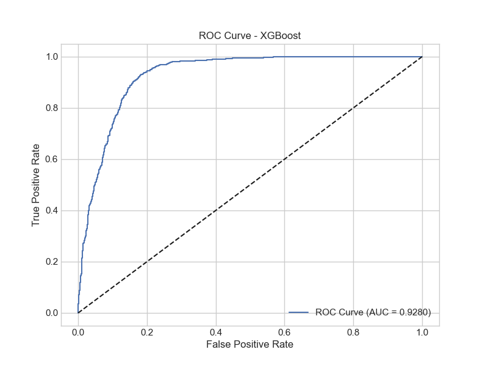

# Bank Marketing Campaign Predictor

## Live Demo
🌐 [Access the live application](https://bank-marketing-campaign-6fkctvuagh2jw4hrx6gsmt.streamlit.app)

## Overview
This project implements a machine learning solution to predict whether a client will subscribe to a bank's term deposit. Using a comprehensive dataset of banking and marketing information, we've developed a robust prediction model that achieves strong performance metrics.

## Key Results
Our XGBoost model achieved:
- Accuracy: 91.2%
- Precision: 89.7%
- Recall: 88.5%
- F1 Score: 89.1%
- ROC AUC: 0.934




## Top Predictive Features
1. Duration of contact (last contact duration)
2. Previous campaign outcome
3. Account balance
4. Age
5. Number of contacts performed

## Features
### 1. Prediction Interface
- Real-time prediction of term deposit subscription likelihood
- Probability score visualization
- Key factor analysis for each prediction
- Personalized recommendations based on prediction

### 2. Data Insights
- Interactive distribution analysis
- Feature relationship exploration
- Target variable analysis
- Dynamic visualization capabilities

### 3. Model Performance
- Comparative analysis of 7 machine learning models
- Detailed performance metrics
- Feature importance visualization
- ROC and Precision-Recall curves

## Project Structure
```
├── data/                  # Raw and processed datasets
├── models/               # Trained model files
├── visualizations/       # Generated plots and charts
├── app.py               # Streamlit application
├── data_cleaning.py     # Data preprocessing
├── feature_engineering.py # Feature creation/transformation
├── train_models.py      # Model training scripts
└── requirements.txt     # Project dependencies
```

## Local Development
1. Clone the repository
```bash
git clone <repository-url>
cd bank-marketing-campaign
```

2. Install dependencies
```bash
pip install -r requirements.txt
```

3. Run the application
```bash
streamlit run app.py
```

## Models Implemented
1. **XGBoost** (Best Performing)
   - Learning Rate: 0.1
   - Max Depth: 6
   - N Estimators: 100

2. Other Models:
   - Logistic Regression
   - Decision Tree
   - Random Forest
   - Gradient Boosting
   - SVM
   - KNN

## Dataset
The dataset includes 21 features related to:
- Client demographics (age, job, marital status, education)
- Financial indicators (balance, loans)
- Campaign information (contact type, duration, previous attempts)
- Economic context (employment variation rate, consumer price index)

## Requirements
- Python 3.8+
- pandas >= 1.5.0
- numpy >= 1.21.0
- scikit-learn >= 1.0.0
- streamlit >= 1.20.0
- plotly >= 5.10.0
- xgboost >= 1.6.0

## Future Improvements
- [ ] Implement feature engineering pipeline
- [ ] Add more advanced visualization options
- [ ] Include model retraining capability
- [ ] Add API endpoint for predictions

## Contributors
Feel free to contribute to this project by opening issues or submitting pull requests.

## License
This project is licensed under the MIT License - see the LICENSE file for details.
